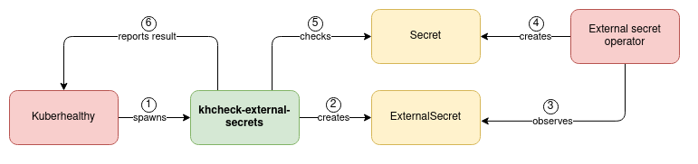

# khcheck-external-secrets

The code in this repository implements a [Kuberhealthy](https://github.com/Comcast/kuberhealthy) check that checks
whether the [external secrets operator](https://github.com/external-secrets/kubernetes-external-secrets) functions as expected.

## Functionality

The diagram below visualizes this check's general functioning.
For brevity, cleanup of ExternalSecret and Secret resources was omitted in the diagram.
Before and after every check, ExternalSecrets and Secrets from previous runs are cleaned up if they exist.



## Install

Install with helm:
```bash
# Add helm repository
helm repo add khcheck-external-secrets https://Nick-Triller.github.io/khcheck-external-secrets
# Create helm values file
cat <<EOF > myvalues.yml
externalSecretTemplate: |
  apiVersion: kubernetes-client.io/v1
  kind: ExternalSecret
  metadata:
    name: my-test-secret
  spec:
    backendType: vault
    data:
      - name: user
        key: secrets/data/khcheck-external-secrets
        property: user
      - name: pass
        key: secrets/data/khcheck-external-secrets
        property: password
EOF
# Create helm release
helm upgrade --install -n kuberhealthy -f myvalues.yml my-release khcheck-external-secrets/khcheck-external-secrets
```

## Configuration

See [chart README](./charts/khcheck-external-secrets/README.md) for configuration options.

## Release process

### Docker image

Pushing a tag on master will trigger a pipeline that builds the Docker container and pushes it
to [docker hub](https://hub.docker.com/repository/docker/nicktriller/khcheck-external-secrets).
The image will be tagged with the git tag.

### Helm chart

Pushing a tag on master in the format `helm-1.2.3` will trigger a pipeline that publishes the chart in `/charts`.
The chart version corresponds to the git tag without the `helm-` prefix.
The chart app version in Chart.yaml is not overwritten.

## License

This project is MIT licensed, see [LICENSE.md](./LICENSE.md).
